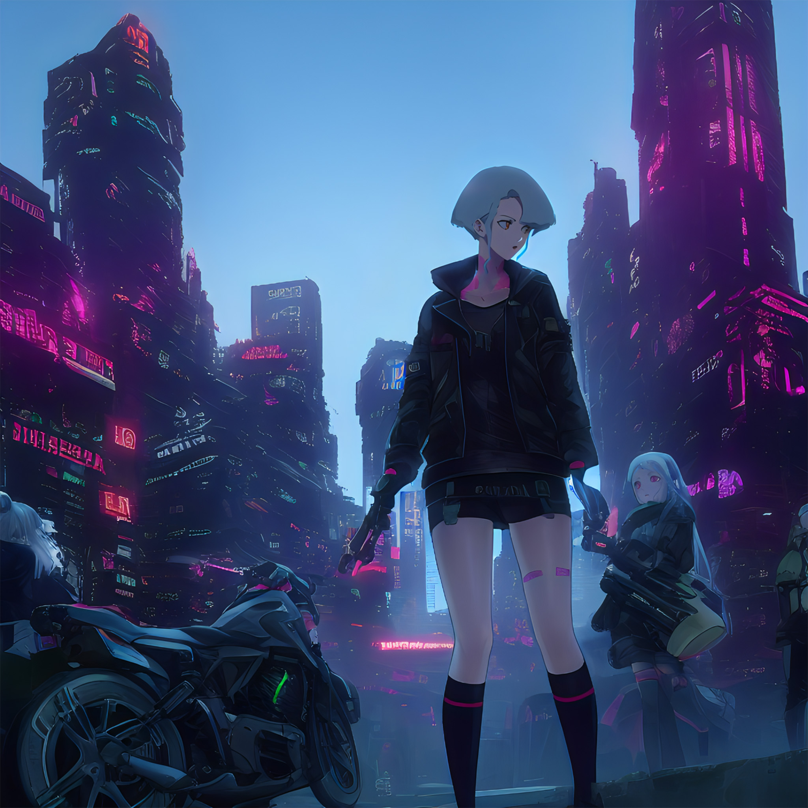
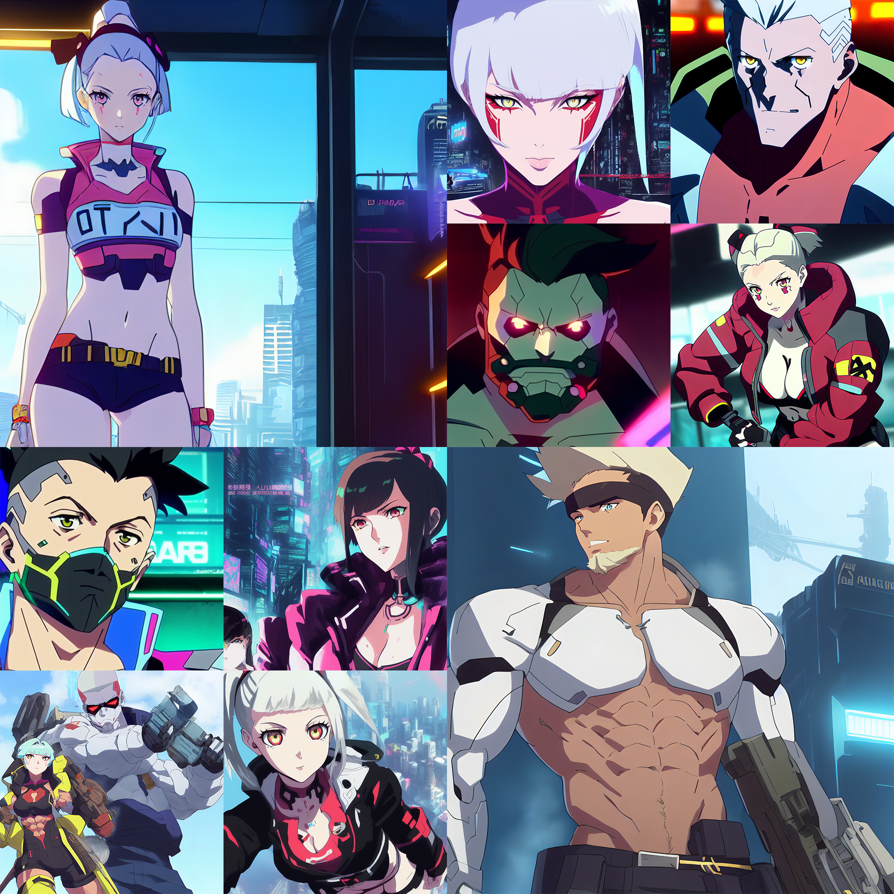
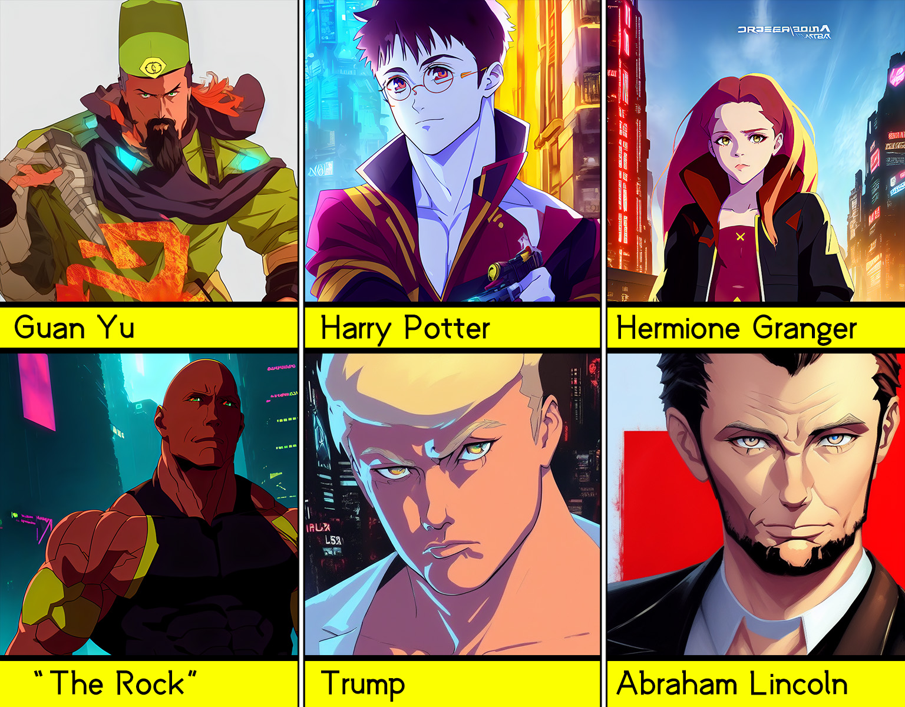
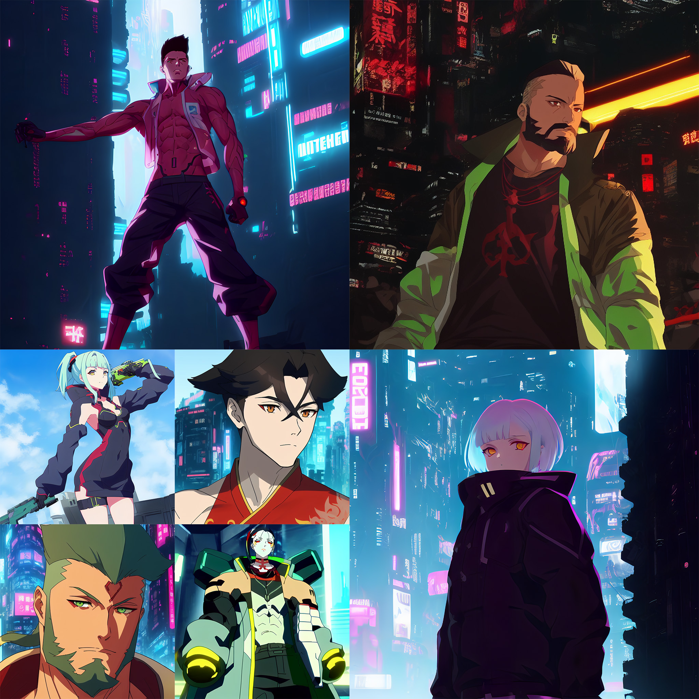
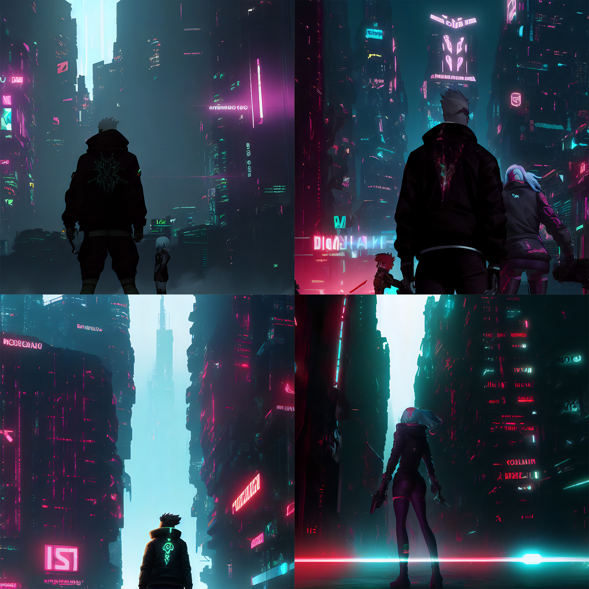
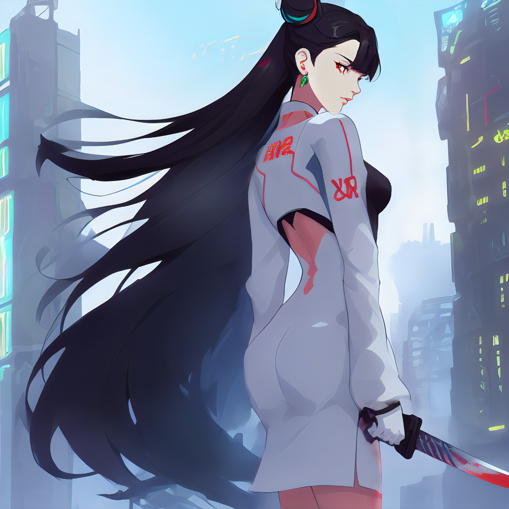

# Cyberpunk Anime Diffusion

An AI model that generates cyberpunk anime characters!~

Based of a finetuned Waifu Diffusion V1.3 Model with Stable Diffusion V1.5 New Vae, training in Dreambooth

by [DGSpitzer](https://www.youtube.com/channel/UCzzsYBF4qwtMwJaPJZ5SuPg)

**This is the repo for hosting Google Colab Notebook, you can download the model weights from here: https://huggingface.co/DGSpitzer/Cyberpunk-Anime-Diffusion**

# Online Demo

You can try the [Gradio](https://github.com/gradio-app/gradio) Online Web UI demo and Colab Notebook at here:

[](https://huggingface.co/spaces/DGSpitzer/DGS-Diffusion-Space) *My Online Space Demo*

[](https://huggingface.co/spaces/anzorq/finetuned_diffusion) *Finetuned Diffusion WebUI Demo by anzorq*

[](https://colab.research.google.com/github/HelixNGC7293/cyberpunk-anime-diffusion/blob/main/cyberpunk_anime_diffusion.ipynb) *Colab Notebook*

[](https://www.buymeacoffee.com/dgspitzer) *Buy me a coffee if you like this project ;P ♥*







# **👇Model👇**

AI Model Weights available at huggingface: https://huggingface.co/DGSpitzer/Cyberpunk-Anime-Diffusion



# Usage

After model loaded, use keyword `dgs` in your prompt, with `illustration style` to get even better results.

**Example 1:**

```
portrait of a girl in dgs illustration style, Anime girl, female soldier working in a cyberpunk city, cleavage, ((perfect femine face)), intricate, 8k, highly detailed, shy, digital painting, intense, sharp focus
```

For cyber robot male character, you can add `muscular male` to improve the output.

**Example 2:**

```
a photo of muscular beard soldier male in dgs illustration style, half-body, holding robot arms, strong chest
```

If using Stable Diffusion Webui, you can set `negative prompt` as this to get cleaner face:

```
body out of frame, deformed, cross-eye, blurry, bad anatomy, ugly, disfigured, poorly drawn face, mutation, mutated, extra limbs
```

---

**NOTE: usage of this model implies accpetance of stable diffusion's [CreativeML Open RAIL-M license](LICENSE)**

---





